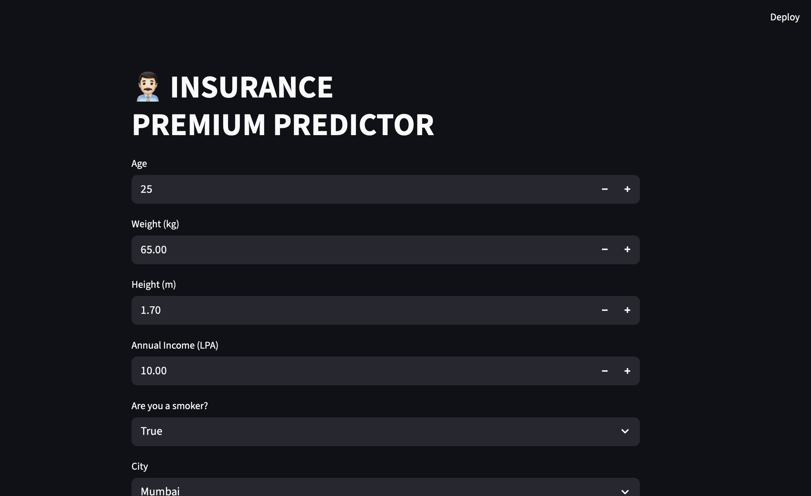
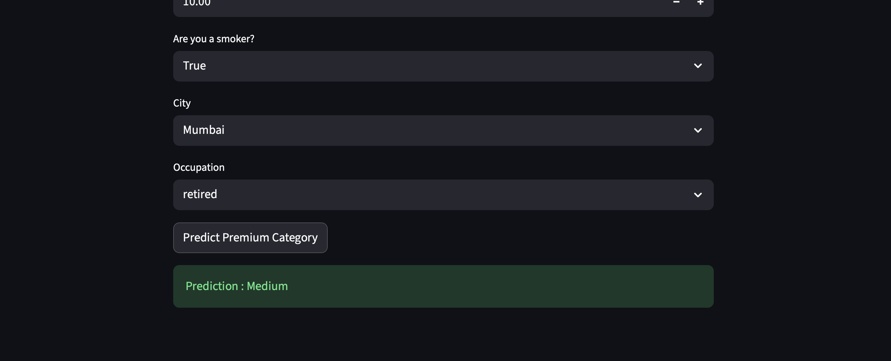
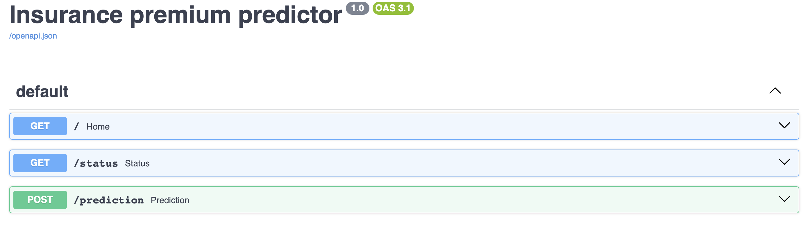
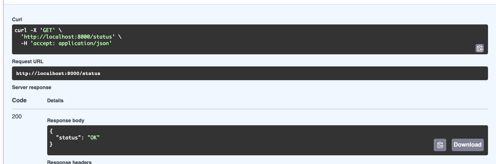

# Insurance Loan Predictor API

A Machine Learning-powered Insurance Loan Prediction System built with FastAPI and Docker. The application predicts insurance loan outcomes based on user-provided information and exposes predictions through a scalable REST API.

---

## Features

- Machine Learning based prediction engine
- FastAPI REST API
- Pydantic schema validation
- Interactive Swagger API documentation
- Dockerized deployment
- Docker Compose support
- Clean and modular project structure
- Production-ready API architecture
- added CI/CD pipeline 

---

## Tech Stack

### Backend
- Python
- FastAPI

### Machine Learning
- NumPy
- Pandas
- Scikit-Learn

### Validation
- Pydantic

### DevOps
- Docker
- Docker Compose
- Docker Hub
- GitHub

---
## Application Screenshots

### Front Page



### Prediction Output



### Dashboard API


### Status


---

## Project Structure

```text
insurance_loan_predictor/
│
├── app/
│   ├── config/
│   ├── model/
│   ├── schema/
│   └── ...
│
├── Dockerfile
├── docker-compose.yml
├── requirements.txt
├── README.md
└── .gitignore
```

---

## Application Workflow

```text
User Input
    │
    ▼
FastAPI API
    │
    ▼
Schema Validation
    │
    ▼
Machine Learning Model
    │
    ▼
Prediction Response
```

---

## Local Setup

Clone the repository:

```bash
git clone https://github.com/ronitjagdale39/insurance_loan_predictor.git
cd insurance_loan_predictor
```

Install dependencies:

```bash
pip install -r requirements.txt
```

Run the application:

```bash
uvicorn app.main:app --reload
```

---

## API Documentation

Swagger UI:

```text
http://localhost:8000/docs
```

ReDoc:

```text
http://localhost:8000/redoc
```

---

## Docker Setup

Build image:

```bash
docker build -t insurance_predictor .
```

Run container:

```bash
docker run -p 8000:8000 insurance_predictor
```

---

## Docker Compose

Start services:

```bash
docker compose up --build
```

Stop services:

```bash
docker compose down
```

---

## Docker Hub

Pull image:

```bash
docker pull dockerronii/insurance_predictor
```

Run image:

```bash
docker run -p 8000:8000 dockerronii/insurance_predictor
```

---

## Future Improvements

- PostgreSQL Integration
- User Authentication & Authorization
- CI/CD Pipeline with GitHub Actions
- Cloud Deployment
- Model Monitoring
- Prediction History Tracking

---

## Author

**Ronit Jagdale**

B.Tech Information Technology  
Pillai College, Panvel

GitHub: https://github.com/ronitjagdale39
